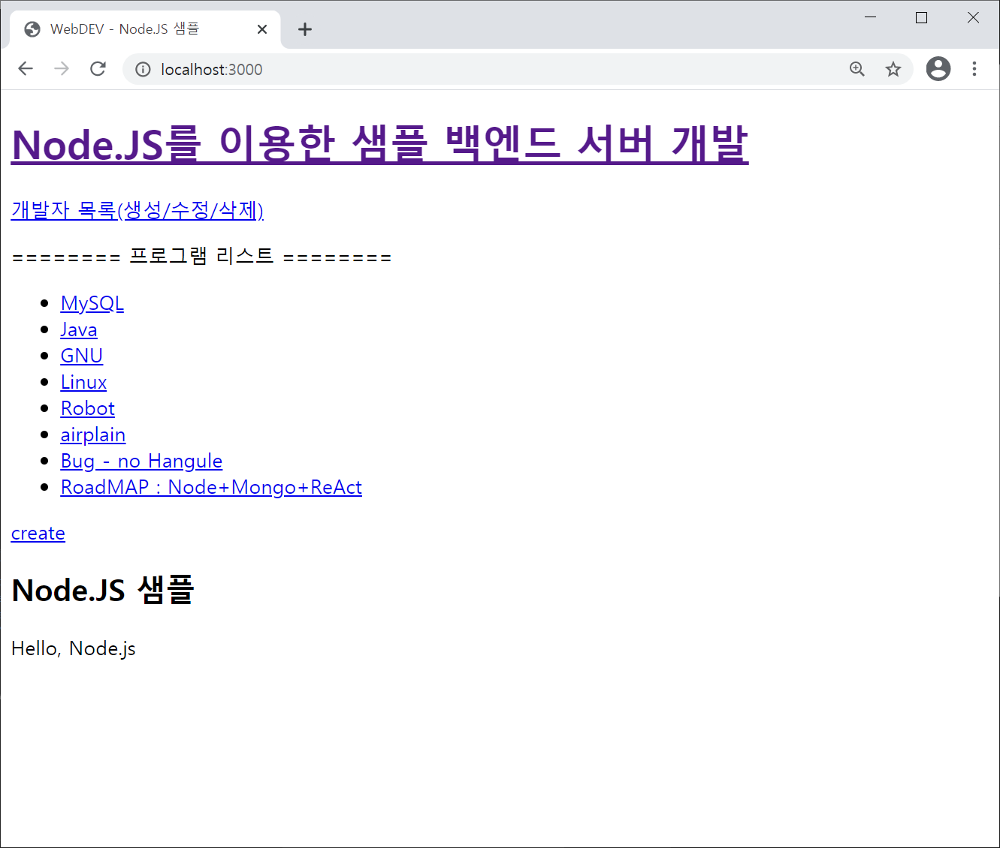
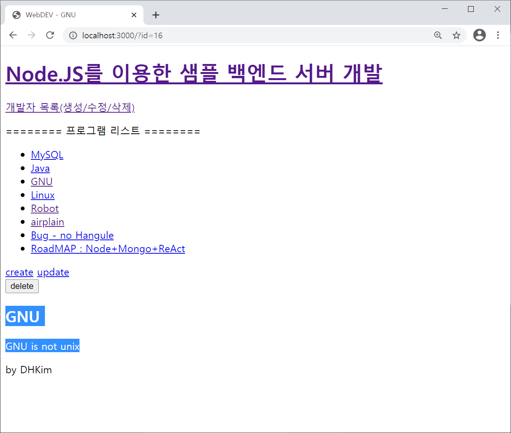
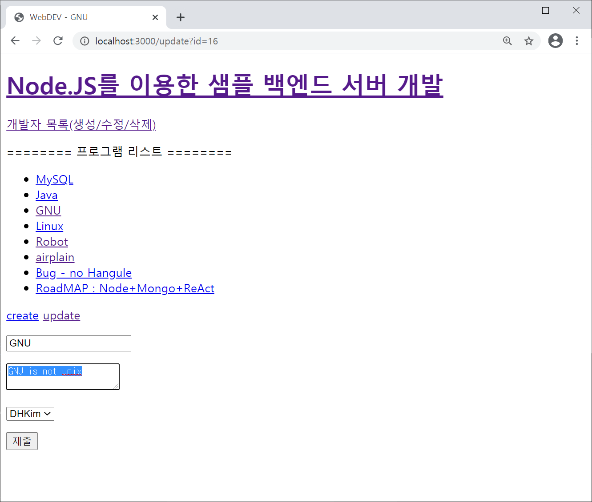
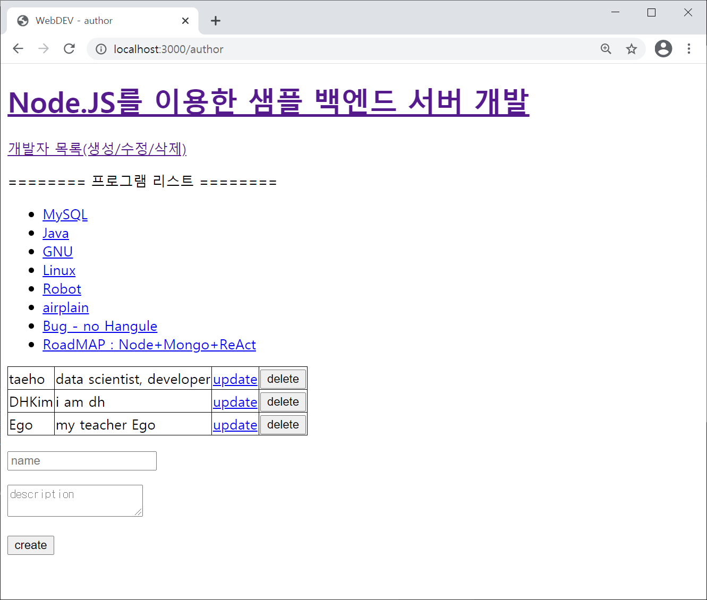
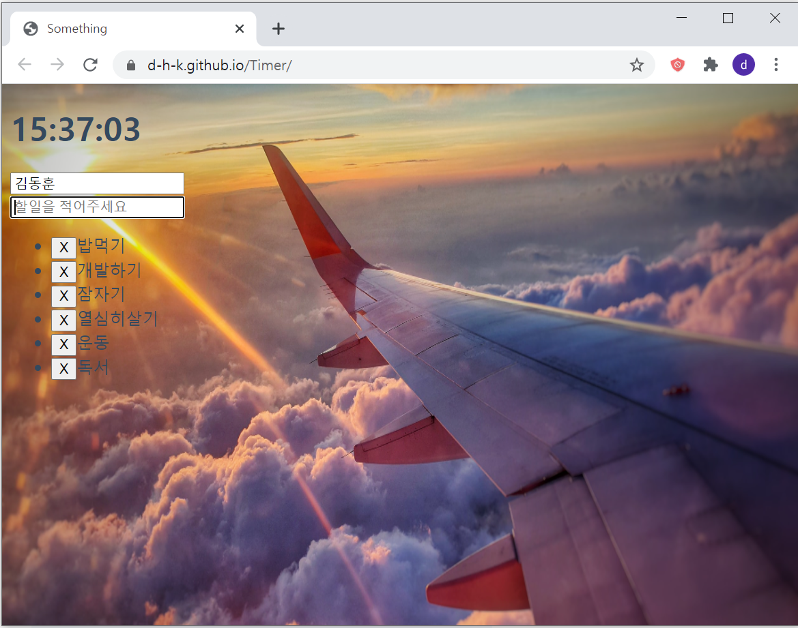
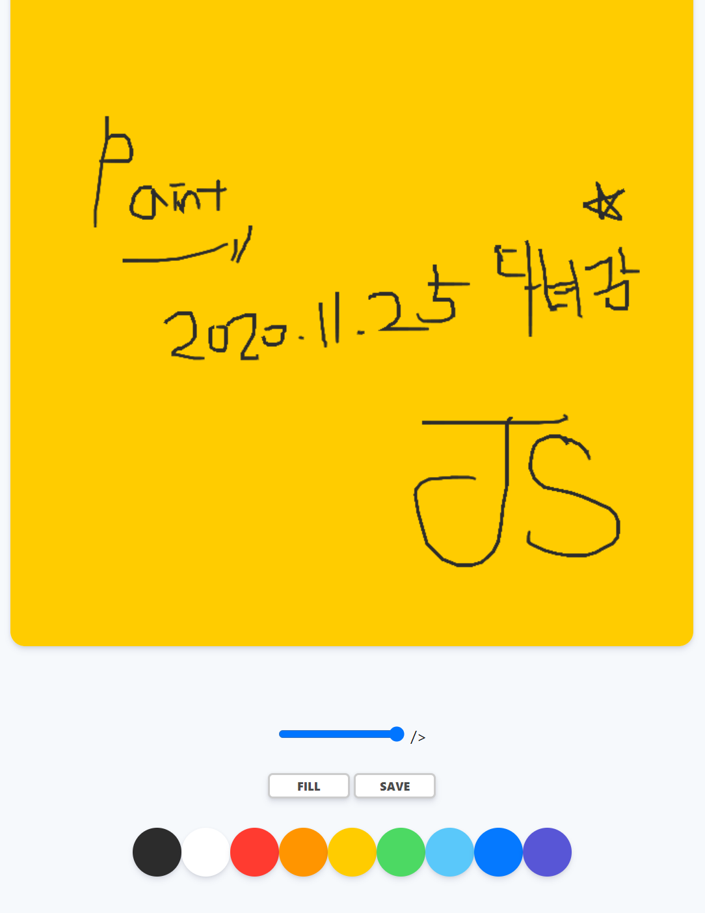
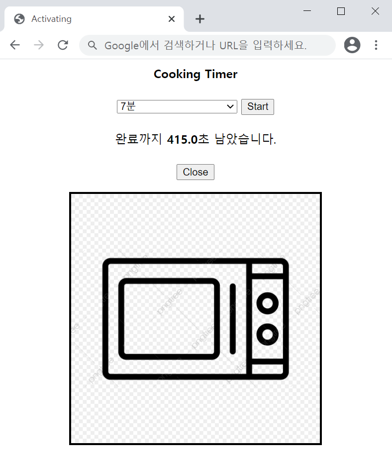

# B 급이라 빼놓은 친구들

# Q&A 게시판 개발
- Demo : https://my-qna-dkim.herokuapp.com/
- 
- 사용기술 : SpringBoot, JPA(H2)
- repo : https://github.com/d-h-k/spring-boot-qna
- 코드스쿼드 백엔드 마스터즈 과정을 진행하며 제작한 프로젝트 입니다

 
 
 

# Firebase샘플(Firebase App)
- Demo : 개발 진행중...
- 사용기술 : Firebase

 
 
 

## Node REST API(부제/영어)
- Demo : None
- 사용기술 : Node.JS, MySQL
- 설명
- 1) 메인화면
  - {: width="60%" height="60%"}
  - 메인화면, 기능은 페이지 요소/개발자 각각의 생성, 수정, 삭제
 
- 2) 하위 요소 선택시
  - {: width="60%" height="60%"}
  - 클릭한 Object에 대한 제목, 설명, 저자에 대한 상세페이지로 이동
  - 해당 상태에서 update를 눌러 글을 수정할 수 있습니다.
 
- 3) 하위 요소 수정기능
  - {: width="60%" height="60%"}
  - update 버튼을 누르면, DOM에 기본 정보가 이미 저장되어있습니다.
  - 여기서 "제출"버튼을 눌러 SQL서버에 데이터를 저장합니다.
 
- 4) 개발자 수정기능
  - {: width="60%" height="60%"}
  - "개발자 목록" 을 클릭하면 개발자를 수정,삭제 혹은 생성할 수 있습니다.
  - 

 
 
 

# 할일목록(To-Do list)
{: width="60%" height="60%"}
- Demo : [https://d-h-k.github.io/Timer/](https://d-h-k.github.io/Timer/)
- 사용기술 : HTML,CSS, JavaScript
- 실제 동작 예시

 
 
 

# 그림판(Paint JS)
{: width="60%" height="60%"}
- Demo : [https://d-h-k.github.io/Paint/](https://d-h-k.github.io/Paint/)
- 사용기술 : HTML,CSS, JavaScript

 
 
 

# 쿠킹타이머(Cooking timer JS)
{: width="60%" height="60%"}
- Demo : [https://d-h-k.github.io/Cook/](https://d-h-k.github.io/Cook/)
- 사용기술 : HTML,CSS, JavaScript

 
 
 

<!--- 주석처리되어 보이지 않는 
//저장

{: width="100" height="100"}

POST 템플릿

## 제목(부제/영어)
- Demo : https://d-h-k.github.io/Paint/(링크)
- 사용기술 : HTML,CSS, JavaScript

 
 

--->

